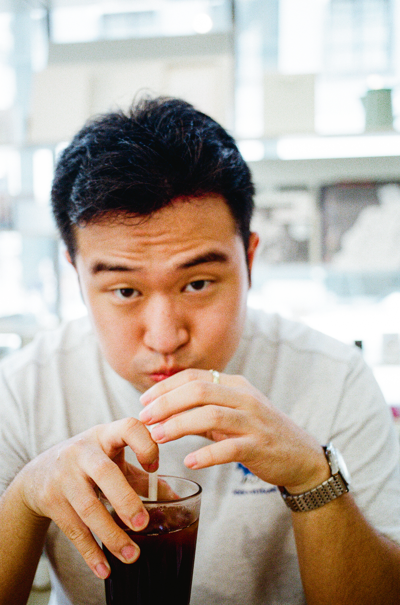

:::  {.column-page}

:::: {layout="[35,65]" style="align-items: flex-start; gap: 2rem; padding: 4rem 0;"}

{style="border-radius: 4px; width: 100%;"}

:::::  {}
# Min Sung Seo

### Postdoctoral Scholar · Penn State

I am a cognitive psychologist studying the neural correlates of episodic memory and aging.

 

[ mks7518@psu.edu](mailto:mks7518@psu.edu) &nbsp;&nbsp;
[ msungseo](https://github.com/msungseo) &nbsp;&nbsp;
[ Google Scholar](https://scholar.google.com/citations?user=JofjEW0AAAAJ&hl=en)

:::::

::::

:::