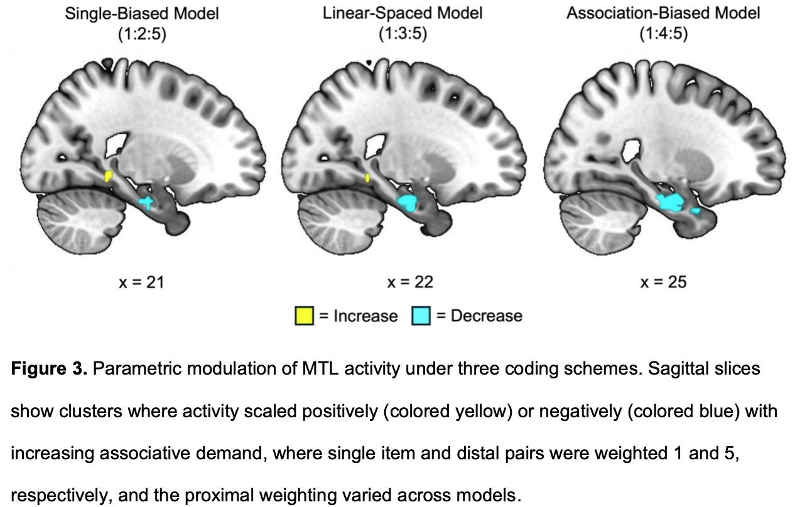
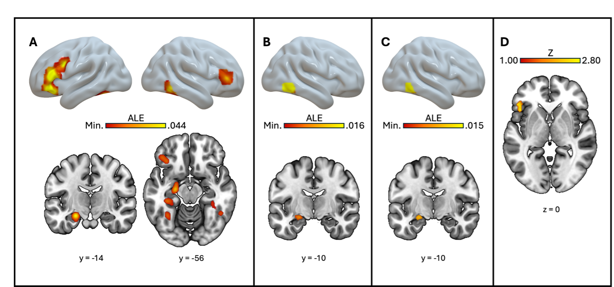

## Under Review

:::: paper-row
::: paper-year
2026
:::
::: paper-info
::: paper-title
Spatially unitized associations occupy an intermediate position along the item-to-association continuum in older adults
:::
::: paper-ref
Seo, M. S., Becker, A., Huang, L. H., Overman, A. A., & Dennis, N. A. (2026). *bioRxiv*.
:::
[[bioRxiv](https://doi.org/10.64898/2026.07.17.739184){.paper-link}]
:::
::: paper-fig

:::
::::

## Peer-Reviewed Publications

:::: paper-row
::: paper-year
2026
:::
::: paper-info
::: paper-title
Temporal interference modulates medial temporal and frontoparietal activity during mnemonic discrimination: A high-resolution whole-brain fMRI investigation
:::
::: paper-ref
Seo, M. S., Wagner, R. L., Chamberlain, J. D., Canada, K. L. & Dennis, N. A. (2026). *Hippocampus.*
:::
[[https://doi.org/10.1002/hipo.70137](https://doi.org/10.1002/hipo.70137){.paper-link}]
:::
::: paper-fig

:::
::::

:::: paper-row
::: paper-year
2026
:::
::: paper-info
::: paper-title
Stronger mnemonic prediction errors can disproportionately impair memory updating in older adults
:::
::: paper-ref
Seo, M. S., Wahlheim, C. N., & Giovanello, K. S. (2026). *Journal of Experimental Psychology: General.*
:::
[[https://doi.org/10.1037/xge0002026](https://doi.org/10.1037/xge0002026){.paper-link}]
:::
::: paper-fig

:::
::::

:::: paper-row
::: paper-year
2026
:::
::: paper-info
::: paper-title
The effects of item versus categorical labeling on subsequent memory
:::
::: paper-ref
Broderick, M., Seo, M. S., & Dennis, N. A. (2026). *Canadian Journal of Experimental Psychology*.
:::
[[https://doi.org/10.1037/cep0000415](https://doi.org/10.1037/cep0000415){.paper-link}]
:::
::: paper-fig
:::
::::

:::: paper-row
::: paper-year
2026
:::
::: paper-info
::: paper-title
Neural correlates of successful relational memory in younger and older adults: An activation likelihood estimation meta-analysis
:::
::: paper-ref
Seo, M. S., & Dennis, N. A. (2026). *Neuroscience & Biobehavioral Reviews*.
:::
[[https://doi.org/10.1016/j.neubiorev.2026.106864](https://doi.org/10.1016/j.neubiorev.2026.106864){.paper-link}]
:::
::: paper-fig

:::
::::