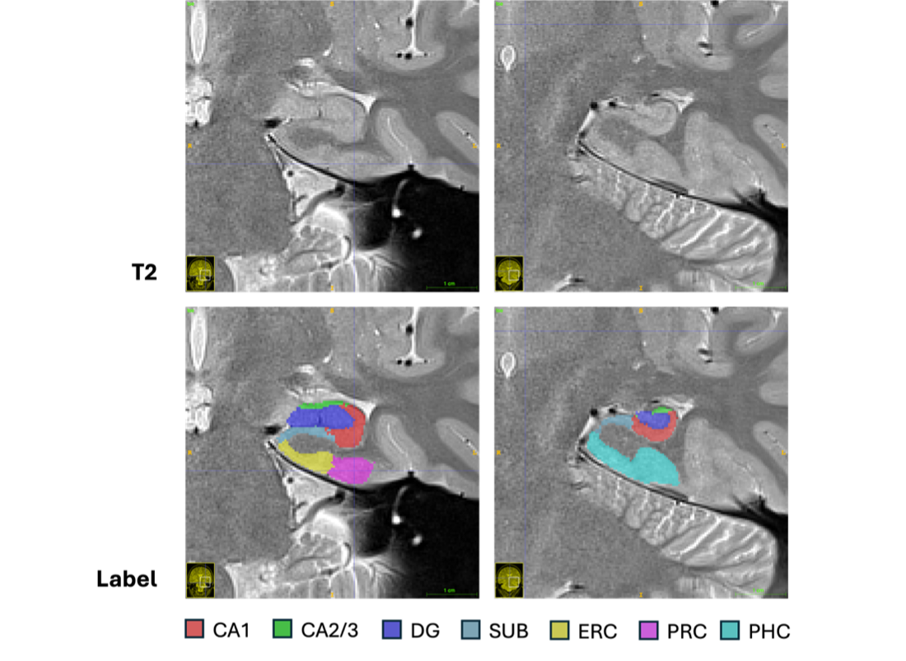
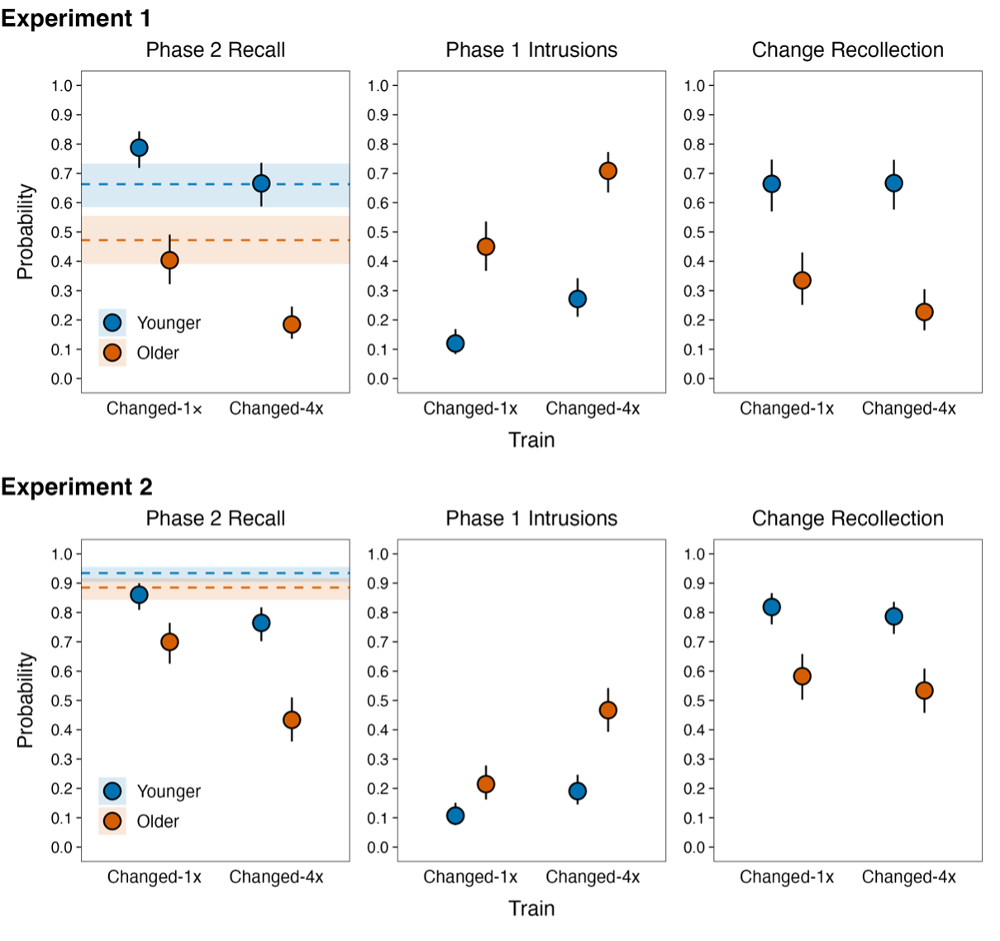

## Preprints

::: paper-row
::: paper-year
2026
:::
::: paper-info
::: paper-title
Temporal Interference Modulates Medial Temporal and Frontoparietal Activity During Mnemonic Discrimination: A high-resolution whole-brain fMRI investigation
:::
::: paper-ref
Seo, M. S., Wagner, R. L., Chamberlain, J. D., & Dennis, N. A. (2026). *bioRxiv*.
:::
[[bioRxiv](https://doi.org/10.64898/2026.03.03.708601){.paper-link}]
:::
::: paper-fig

:::
:::

::: paper-row
::: paper-year
2024
:::
::: paper-info
::: paper-title
Stronger Mnemonic Prediction Errors Can Disproportionately Impair Memory Updating in Older Adults
:::
::: paper-ref
Seo, M. S., Wahlheim, C., & Giovanello, K. (2024). *PsyArXiv*.
:::
[[PsyArXiv](https://doi.org/10.31234/osf.io/gcr8a_v1){.paper-link}]
:::
::: paper-fig

:::
:::

---

## Peer-Reviewed Publications

*Coming soon.*